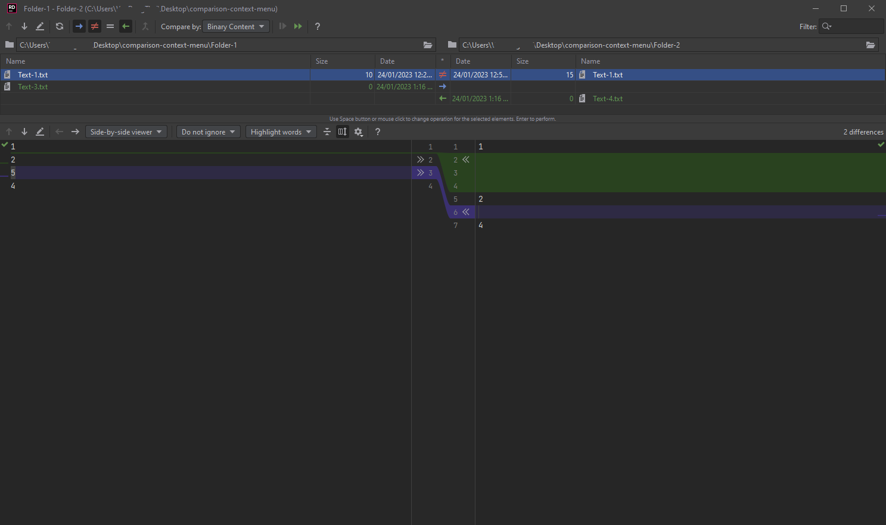

# Comparison context menu (Jetbrains Rider IDE)

After years of using [Beyond Compare](https://www.scootersoftware.com/), I walked away from it because I have license no more. 
I had tried several diff tools, I found that none of them satisfying me until I got Jetbrains Rider IDE.

Yes, [Jetbrains Rider IDE](https://www.jetbrains.com/rider/) is not literally a diff tool, it is an IDE with a built-in diff feature.
- File comparison

- Folder comparison


I like the way differences are highlighted and aligned. It makes me feel I am using Beyond Compare which was a very great experience.

There are probably other good diff tools, however, now I use Rider as my primary IDE for daily work, a built-in diff feature will make my working experience consistent,
so that I decide to stick with the Rider built-in diff feature.

The bad news is that it is a bit inconvenient to launch Rider diff feature from outside of Rider IDE. [The only one way to do it is using command line](https://www.jetbrains.com/help/rider/Command_Line_Differences_Viewer.html). 

I was inspired by Beyond Compare to create this repository to add a dynamic context menu for easily comparing files with Rider diff feature. Under the hood, it invokes the Rider diff feature via command line.

It works for both files as well as folders.

Here some of my use cases.
- Select to compare.


- Multi select to compare.
  

# Installation

1/ Build `ComparisonContextMenu` from the source code.

2/ Copy the output package to somewhere stable. For example, `C:\Program Files\ComparisonContextMenu`.


3/ Download [ServerRegistrationManager.zip](https://github.com/dwmkerr/sharpshell/releases).

4/ Open CMD with Admin rights, and execute the command below
```
ServerRegistrationManager.exe install "C:\Program Files\ComparisonContextMenu\ComparisonContextMenu.dll" -codebase -os64
```

5/ Done.

# Reference

1/ For any reason, the comparison context menu does not show up. You might need to check log for further investigation. Check these documents for getting logs.
https://github.com/dwmkerr/sharpshell/blob/main/docs/installing/installing.md
https://github.com/dwmkerr/sharpshell/blob/main/docs/srm/srm.md
https://github.com/dwmkerr/sharpshell/blob/main/docs/logging/logging.md

Example from the official document:
```
srm config LoggingMode File
srm config LogPath '%TEMP%\SharpShell.log'
srm install <path.dll>
srm config LoggingMode Disable
```

2/ Backup of Server Registration Manager Tool can be found on [the first release](https://github.com/VanDng/comparison-context-menu/releases/tag/first-release).
